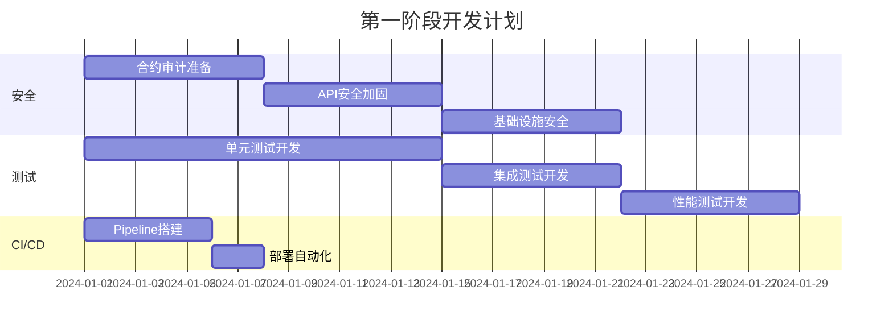
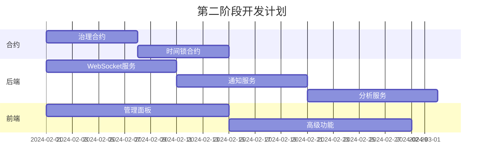
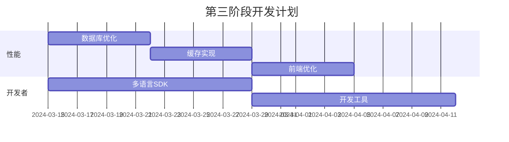

# 🗺️ ZKFair L2 开发路线图

## 📊 项目现状总览

### ✅ 已完成组件 (70%)

| 组件 | 完成度 | 说明 |
|------|--------|------|
| 智能合约 | 90% | 核心合约已完成，缺少治理和时间锁 |
| 前端应用 | 80% | 基础功能完成，需要优化和测试 |
| 后端API | 85% | 核心API完成，缺少WebSocket和通知 |
| Bundler | 95% | 功能完整，需要性能优化 |
| 监控系统 | 90% | 基础监控完成，需要APM |
| 文档 | 85% | 主要文档完成，需要API文档 |

### ❌ 待开发组件 (30%)

## 🚧 待开发功能清单

### 1. 紧急 - 生产就绪必需 🔴

#### 1.1 安全基础设施
```yaml
任务优先级: P0
预计工时: 2周
负责团队: 安全团队

待开发项:
  - [ ] 智能合约审计准备
      - [ ] 完善NatSpec文档
      - [ ] 添加更多安全测试
      - [ ] 准备审计材料
  
  - [ ] API安全加固
      - [ ] JWT认证系统
      - [ ] API密钥管理
      - [ ] 请求签名验证
      - [ ] SQL注入防护
  
  - [ ] 基础设施安全
      - [ ] SSL/TLS配置
      - [ ] WAF部署
      - [ ] DDoS防护
      - [ ] 安全头配置
```

#### 1.2 测试覆盖
```yaml
任务优先级: P0
预计工时: 3周
负责团队: QA团队

待开发项:
  - [ ] 单元测试
      - [ ] 后端服务 (目标: 80%覆盖率)
      - [ ] 前端组件 (目标: 70%覆盖率)
      - [ ] SDK测试 (目标: 90%覆盖率)
  
  - [ ] 集成测试
      - [ ] API端到端测试
      - [ ] 合约集成测试
      - [ ] 服务间通信测试
  
  - [ ] 性能测试
      - [ ] 负载测试脚本
      - [ ] 压力测试场景
      - [ ] 基准测试套件
```

#### 1.3 CI/CD管道
```yaml
任务优先级: P0
预计工时: 1周
负责团队: DevOps团队

待开发项:
  - [ ] GitHub Actions配置
      - [ ] 自动化测试
      - [ ] 代码质量检查
      - [ ] 安全扫描
      - [ ] 自动部署
  
  - [ ] 部署脚本
      - [ ] 测试网部署
      - [ ] 主网部署
      - [ ] 回滚机制
```

### 2. 重要 - 功能完整性 🟡

#### 2.1 缺失的智能合约
```solidity
任务优先级: P1
预计工时: 2周
负责团队: 合约团队

待开发项:
  - [ ] Governance.sol
      // 治理合约 - DAO投票机制
      contract Governance {
          function propose(bytes calldata proposal);
          function vote(uint256 proposalId, bool support);
          function execute(uint256 proposalId);
      }
  
  - [ ] Timelock.sol
      // 时间锁合约 - 延迟执行
      contract Timelock {
          function schedule(address target, bytes data, uint256 delay);
          function execute(bytes32 id);
      }
  
  - [ ] FeeCollector.sol
      // 手续费收集和分配
      contract FeeCollector {
          function collectFees();
          function distributeFees();
      }
```

#### 2.2 后端服务增强
```typescript
任务优先级: P1
预计工时: 3周
负责团队: 后端团队

待开发项:
  - [ ] WebSocket服务
      - [ ] 实时交易推送
      - [ ] 钱包余额更新
      - [ ] 区块事件通知
  
  - [ ] 通知服务
      - [ ] 邮件通知
      - [ ] 短信通知
      - [ ] 推送通知
      - [ ] Webhook集成
  
  - [ ] 分析服务
      - [ ] 用户行为分析
      - [ ] 交易统计
      - [ ] 性能指标
```

#### 2.3 前端功能
```typescript
任务优先级: P1
预计工时: 2周
负责团队: 前端团队

待开发项:
  - [ ] 管理员面板
      - [ ] 系统监控仪表板
      - [ ] 用户管理
      - [ ] 交易管理
      - [ ] 配置管理
  
  - [ ] 高级钱包功能
      - [ ] 多签钱包支持
      - [ ] 社交恢复UI
      - [ ] 批量交易构建器
      - [ ] 高级设置
  
  - [ ] UI/UX优化
      - [ ] 响应式设计完善
      - [ ] 深色模式
      - [ ] 多语言支持
      - [ ] 无障碍支持
```

### 3. 优化 - 性能和体验 🟢

#### 3.1 性能优化
```yaml
任务优先级: P2
预计工时: 2周
负责团队: 架构团队

待开发项:
  - [ ] 数据库优化
      - [ ] 查询优化
      - [ ] 索引策略
      - [ ] 连接池配置
      - [ ] 读写分离
  
  - [ ] 缓存层
      - [ ] Redis缓存策略
      - [ ] CDN配置
      - [ ] 静态资源优化
      - [ ] API响应缓存
  
  - [ ] 前端性能
      - [ ] 代码分割
      - [ ] 懒加载
      - [ ] 资源压缩
      - [ ] Service Worker
```

#### 3.2 开发者体验
```yaml
任务优先级: P2
预计工时: 2周
负责团队: DevRel团队

待开发项:
  - [ ] SDK扩展
      - [ ] Python SDK
      - [ ] Go SDK
      - [ ] Java SDK
      - [ ] Rust SDK
  
  - [ ] 开发工具
      - [ ] CLI工具
      - [ ] VS Code插件
      - [ ] 调试工具
      - [ ] 模拟器
  
  - [ ] 文档完善
      - [ ] API文档 (OpenAPI)
      - [ ] 视频教程
      - [ ] 示例项目
      - [ ] 最佳实践
```

### 4. 创新 - 未来功能 🔵

#### 4.1 高级特性
```yaml
任务优先级: P3
预计工时: 4周
负责团队: 研发团队

待开发项:
  - [ ] 跨链桥
      - [ ] 以太坊桥
      - [ ] BSC桥
      - [ ] Polygon桥
      - [ ] 通用消息传递
  
  - [ ] DeFi集成
      - [ ] DEX集成
      - [ ] 借贷协议
      - [ ] 收益聚合
      - [ ] 流动性挖矿
  
  - [ ] 高级隐私
      - [ ] 隐私交易
      - [ ] 混币器
      - [ ] 零知识身份
```

## 📅 开发时间线

### 第一阶段：生产就绪 (4周)


### 第二阶段：功能完整 (6周)


### 第三阶段：优化提升 (4周)


## 🎯 里程碑

| 里程碑 | 目标日期 | 关键成果 |
|--------|----------|----------|
| M1: 安全基线 | 2024-01-21 | 通过安全审计，0严重漏洞 |
| M2: 测试覆盖 | 2024-01-28 | 代码覆盖率>80% |
| M3: 自动化部署 | 2024-02-04 | CI/CD全流程自动化 |
| M4: 功能完整 | 2024-03-14 | 所有核心功能上线 |
| M5: 性能达标 | 2024-04-11 | TPS>2000，延迟<2s |
| M6: 主网就绪 | 2024-04-30 | 主网部署检查清单100% |

## 👥 团队分工

### 团队结构
```
技术负责人 (CTO)
├── 合约团队 (3人)
│   ├── 合约开发
│   ├── 安全审计
│   └── Gas优化
├── 后端团队 (4人)
│   ├── API开发
│   ├── 服务开发
│   ├── 数据库
│   └── 集成
├── 前端团队 (3人)
│   ├── UI开发
│   ├── UX设计
│   └── 移动端
├── DevOps团队 (2人)
│   ├── 基础设施
│   └── 监控运维
└── QA团队 (2人)
    ├── 测试开发
    └── 质量保证
```

### 技能需求
- **合约开发**: Solidity, Foundry, 安全最佳实践
- **后端开发**: Node.js, TypeScript, PostgreSQL
- **前端开发**: React, Web3, 响应式设计
- **DevOps**: Docker, K8s, 监控工具
- **QA**: 自动化测试, 性能测试

## 📈 成功指标

### 技术指标
- [ ] 智能合约代码覆盖率 > 95%
- [ ] API测试覆盖率 > 80%
- [ ] 系统可用性 > 99.9%
- [ ] 平均响应时间 < 200ms
- [ ] TPS > 2000

### 业务指标
- [ ] 开发者文档完整度 100%
- [ ] SDK支持语言 >= 4种
- [ ] 安全漏洞 0个严重/高危
- [ ] 用户反馈响应时间 < 24h

## 🚀 快速启动开发

### 1. 选择你的任务
```bash
# 查看所有待办
grep -r "TODO" . | grep -v node_modules

# 查看特定模块待办
grep -r "TODO" contracts/
grep -r "TODO" backend/
```

### 2. 创建开发分支
```bash
git checkout -b feature/your-feature-name
```

### 3. 开发测试循环
```bash
# 开发
code .

# 测试
npm test  # 或 forge test

# 提交
git add .
git commit -m "feat: add your feature"
```

### 4. 提交PR
- 确保通过所有测试
- 更新相关文档
- 请求代码审查

## 📚 资源链接

### 内部资源
- [技术架构文档](./architecture.md)
- [API设计规范](./api-design.md)
- [代码规范](./code-style.md)
- [测试指南](./testing-guide.md)

### 外部资源
- [ERC-4337标准](https://eips.ethereum.org/EIPS/eip-4337)
- [Polygon CDK文档](https://wiki.polygon.technology/docs/cdk/)
- [Celestia集成指南](https://docs.celestia.org/)

---

**让我们一起构建更好的Layer 2！** 🚀

最后更新：2024年