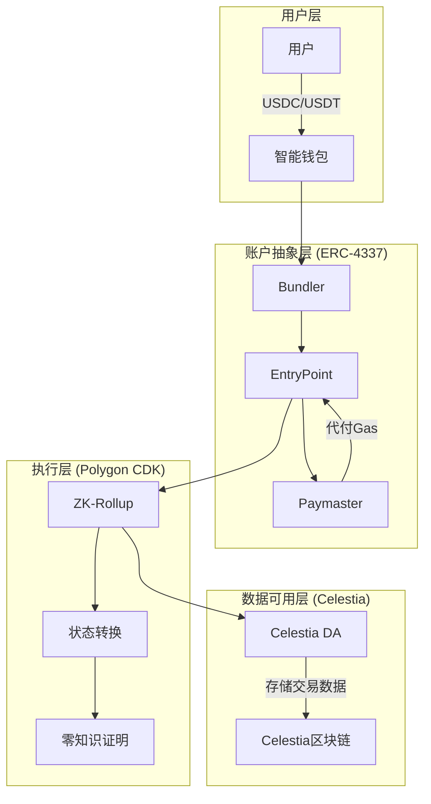

# 🚀 ZKFair L2 - 新人快速入门指南

> 让您在30分钟内理解整个项目！

## 📖 目录

1. [项目是什么？](#1-项目是什么)
2. [为什么要做这个？](#2-为什么要做这个)
3. [技术架构总览](#3-技术架构总览)
4. [核心组件详解](#4-核心组件详解)
5. [快速开始](#5-快速开始)
6. [开发工作流](#6-开发工作流)
7. [常见问题](#7-常见问题)
8. [下一步学习](#8-下一步学习)

---

## 1. 项目是什么？

### 一句话说明
**ZKFair L2 是一个让用户可以用稳定币（USDC/USDT）支付gas费的Layer 2区块链。**

### 通俗解释
想象一下：
- 传统区块链 = 高速公路（需要用专门的通行币ETH付费）
- ZKFair L2 = 智能高速公路（可以用美元稳定币付费）

### 核心创新
```
传统方式：用户 → 需要ETH → 执行交易 → 支付ETH作为gas
我们的方式：用户 → 只需USDC → 执行交易 → 自动转换支付
```

## 2. 为什么要做这个？

### 现有问题
1. **用户门槛高** - 新用户需要先购买ETH才能使用DApp
2. **价格波动大** - ETH价格波动导致交易成本不可预测  
3. **用户体验差** - 需要管理多种代币

### 我们的解决方案
1. **降低门槛** - 用户只需持有稳定币即可
2. **成本可预测** - 稳定币价格稳定，gas费用透明
3. **体验优化** - 一种代币完成所有操作

## 3. 技术架构总览

### 三大核心技术



### 技术栈分层

| 层级 | 技术 | 作用 |
|------|------|------|
| 前端 | React + TypeScript | 用户界面 |
| SDK | TypeScript SDK | 开发者集成 |
| API | Node.js + Express | 业务逻辑 |
| 智能合约 | Solidity | 链上逻辑 |
| Layer 2 | Polygon CDK | 扩容方案 |
| 数据可用性 | Celestia | 降低成本 |

## 4. 核心组件详解

### 4.1 智能合约 (`/contracts`)

#### EntryPoint合约
```solidity
// 核心功能：处理用户操作
contract EntryPoint {
    // 验证并执行用户操作
    function handleOps(UserOperation[] ops);
    // 管理账户存款
    function depositTo(address account);
}
```

#### Paymaster合约
```solidity
// 核心功能：代付gas费
contract Paymaster {
    // 验证是否愿意为用户支付gas
    function validatePaymasterUserOp(UserOp op);
    // 从用户的稳定币中扣费
    function postOp(mode, context, actualGasCost);
}
```

#### 智能钱包
```solidity
// 核心功能：用户的智能合约钱包
contract SmartWallet {
    // 执行用户交易
    function execute(address to, uint256 value, bytes data);
    // 批量执行
    function executeBatch(address[] to, bytes[] data);
}
```

### 4.2 后端服务 (`/backend`)

```typescript
// API端点示例
POST   /api/wallet/create      // 创建钱包
POST   /api/transaction/send   // 发送交易
GET    /api/wallet/:address    // 查询钱包
WS     /ws/subscribe           // 实时订阅
```

### 4.3 Bundler服务 (`/bundler`)

```typescript
// 打包用户操作并提交到链上
class Bundler {
    collectUserOps()     // 收集操作
    validateUserOps()    // 验证操作
    bundleUserOps()      // 打包操作
    submitToChain()      // 提交上链
}
```

### 4.4 前端应用 (`/frontend`)

```typescript
// 主要页面
/                    // 首页
/wallet              // 钱包管理
/swap                // 代币兑换
/transactions        // 交易历史
```

### 4.5 监控系统 (`/monitoring`)

```yaml
Prometheus:  收集指标
Grafana:     可视化展示
AlertManager: 告警通知
```

## 5. 快速开始

### 5.1 环境准备

```bash
# 1. 克隆项目
git clone <repository>
cd zkfair

# 2. 安装依赖
npm install            # 前端/后端
forge install          # 智能合约

# 3. 配置环境变量
cp .env.example .env
# 编辑 .env 文件
```

### 5.2 本地运行

```bash
# 1. 启动基础设施
docker-compose up -d postgres redis

# 2. 部署合约（本地测试网）
cd contracts
forge script script/Deploy.s.sol --rpc-url localhost --broadcast

# 3. 启动后端
cd backend
npm run dev

# 4. 启动前端
cd frontend
npm run dev

# 5. 启动bundler
cd bundler
npm run dev
```

### 5.3 测试流程

```bash
# 1. 运行合约测试
forge test -vvv

# 2. 创建测试钱包
curl -X POST http://localhost:3001/api/wallet/create \
  -H "Content-Type: application/json" \
  -d '{"owner": "0x..."}'

# 3. 发送测试交易
# 使用前端界面或API
```

## 6. 开发工作流

### 6.1 项目结构

```
zkfair/
├── contracts/          # 智能合约
│   ├── src/           # 合约源码
│   ├── test/          # 合约测试
│   └── script/        # 部署脚本
├── frontend/          # React前端
│   ├── src/
│   │   ├── components/  # 组件
│   │   ├── pages/      # 页面
│   │   └── hooks/      # Hooks
├── backend/           # API服务
│   ├── src/
│   │   ├── routes/     # 路由
│   │   ├── services/   # 业务逻辑
│   │   └── models/     # 数据模型
├── bundler/           # Bundler服务
├── sdk/               # 开发者SDK
└── monitoring/        # 监控配置
```

### 6.2 开发流程

1. **理解需求**
   ```
   用户故事 → 技术方案 → 实现计划
   ```

2. **编写代码**
   ```
   TDD: 测试 → 实现 → 重构
   ```

3. **测试验证**
   ```
   单元测试 → 集成测试 → E2E测试
   ```

4. **代码审查**
   ```
   提交PR → 审查 → 合并
   ```

### 6.3 常用命令

```bash
# 合约开发
forge build              # 编译合约
forge test              # 运行测试
forge fmt               # 格式化代码

# 前端开发
npm run dev             # 开发服务器
npm run build           # 构建生产版本
npm run lint            # 代码检查

# 后端开发
npm run dev             # 开发服务器
npm run test            # 运行测试
npm run migrate         # 数据库迁移
```

## 7. 常见问题

### Q1: 用户的稳定币是如何转换成ETH支付gas的？

**答案**：通过Paymaster合约
```
1. 用户发起交易（使用USDC）
2. Paymaster验证用户余额
3. Paymaster代付ETH作为gas
4. 交易完成后，Paymaster从用户扣除等值USDC
```

### Q2: 为什么需要Bundler？

**答案**：ERC-4337的核心组件
```
- 收集多个用户操作
- 打包成一个交易
- 提高效率，降低成本
```

### Q3: Celestia是做什么的？

**答案**：数据可用性层
```
- 存储交易数据
- 比以太坊便宜95%
- 保证数据可验证
```

### Q4: 零知识证明在哪里使用？

**答案**：Polygon CDK中
```
- 证明状态转换的正确性
- 无需暴露交易细节
- 提高隐私和效率
```

## 8. 下一步学习

### 8.1 深入学习路径

1. **智能合约开发**
   - 学习Solidity
   - 理解ERC-4337标准
   - 阅读合约源码

2. **后端开发**
   - Node.js + TypeScript
   - 数据库设计
   - API设计模式

3. **前端开发**
   - React生态
   - Web3集成
   - 用户体验设计

4. **区块链原理**
   - Layer 2扩容方案
   - 零知识证明
   - 数据可用性

### 8.2 推荐资源

#### 官方文档
- [ERC-4337规范](https://eips.ethereum.org/EIPS/eip-4337)
- [Polygon CDK文档](https://wiki.polygon.technology/docs/cdk/)
- [Celestia文档](https://docs.celestia.org/)

#### 项目文档
- [技术架构](./architecture.md)
- [API参考](./api-reference.md)
- [部署指南](./deployment-guide.md)

#### 视频教程
- [Account Abstraction入门](https://www.youtube.com/watch?v=...)
- [Layer 2原理讲解](https://www.youtube.com/watch?v=...)

### 8.3 参与贡献

1. **找到感兴趣的任务**
   ```bash
   # 查看待办事项
   grep -r "TODO" .
   # 查看GitHub Issues
   ```

2. **开始贡献**
   ```bash
   # Fork项目
   # 创建分支
   git checkout -b feature/your-feature
   # 提交PR
   ```

3. **代码规范**
   - 遵循项目代码风格
   - 编写测试
   - 更新文档

## 🎯 快速检查清单

完成以下步骤，确保你已经理解项目：

- [ ] 理解三大核心技术的作用
- [ ] 能够解释用户如何用稳定币付gas
- [ ] 成功运行本地开发环境
- [ ] 完成一笔测试交易
- [ ] 理解主要合约的功能
- [ ] 知道各个服务的职责
- [ ] 能够查看监控面板

## 📞 获取帮助

遇到问题时：

1. **查看文档** - `/docs`目录
2. **搜索代码** - 使用 `grep` 或 IDE 搜索
3. **查看测试** - 测试代码是最好的示例
4. **提问** - 在项目群组或Issues中提问

---

**欢迎加入ZKFair L2项目！** 🚀

> "The best way to learn is by doing. Start small, think big!"

最后更新：2024年