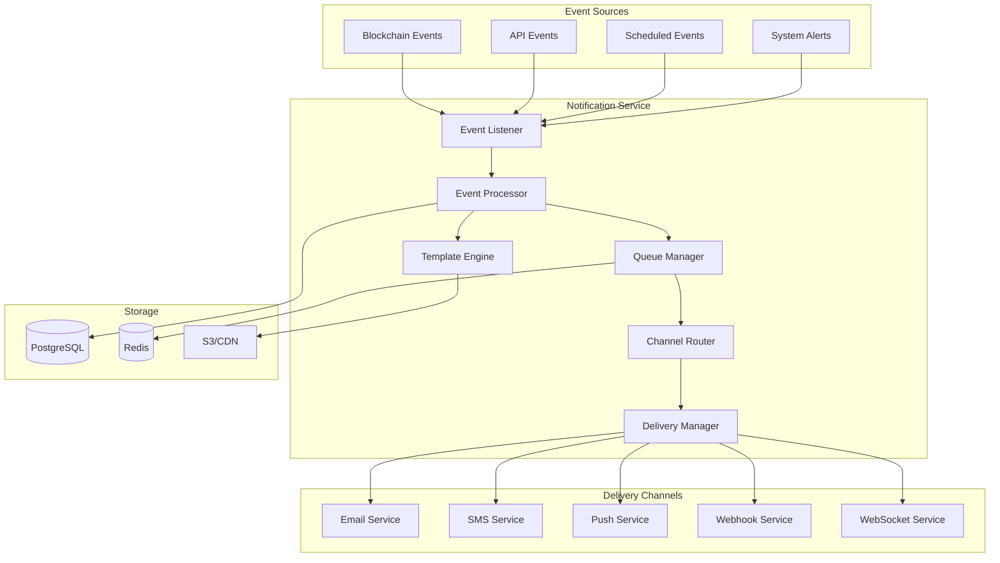

# Notification Service Design Document

## Overview

The ZKFair L2 Notification Service is a comprehensive, multi-channel notification system designed to keep users informed about important events, transactions, and system updates. It supports email, SMS, push notifications, webhooks, and in-app notifications.

## Architecture

### Core Components

```
┌─────────────────┐     ┌──────────────────┐     ┌─────────────────┐
│                 │     │                  │     │                 │
│  Event Sources  │────▶│ Notification     │────▶│    Channels     │
│                 │     │    Service       │     │                 │
└─────────────────┘     └──────────────────┘     └─────────────────┘
        │                        │                         │
        │                        │                         │
   - Blockchain              - Queue                 - Email (SendGrid)
   - Smart Contracts         - Router                - SMS (Twilio)
   - Backend API            - Template Engine        - Push (FCM/APNs)
   - WebSocket              - Preference Manager     - Webhooks
   - Scheduled Jobs         - Rate Limiter           - In-App
                           - Retry Manager
```

### System Design



## Notification Types

### 1. Transaction Notifications
- **Transaction Sent**: When user initiates a transaction
- **Transaction Confirmed**: When transaction is confirmed on-chain
- **Transaction Failed**: When transaction fails
- **Gas Price Alert**: When gas prices exceed threshold

### 2. Account Notifications
- **Login Alert**: New device/location login
- **Security Alert**: Suspicious activity detected
- **Balance Update**: Significant balance changes
- **Wallet Recovery**: Recovery process initiated

### 3. Governance Notifications
- **New Proposal**: When governance proposal is created
- **Voting Reminder**: Before voting deadline
- **Proposal Outcome**: When proposal passes/fails
- **Execution Notice**: When proposal is executed

### 4. System Notifications
- **Maintenance Notice**: Scheduled maintenance
- **Feature Update**: New features released
- **Security Update**: Important security updates
- **Network Status**: Network issues or recovery

### 5. Marketing Notifications
- **Promotional**: Special offers, events
- **Educational**: Tips, tutorials
- **Community**: Community events, AMAs

## Implementation Details

### Event Schema

```typescript
interface NotificationEvent {
  id: string;
  type: NotificationType;
  severity: 'info' | 'warning' | 'error' | 'critical';
  userId?: string;
  data: Record<string, any>;
  metadata: {
    source: string;
    timestamp: number;
    correlationId?: string;
    retryCount?: number;
  };
}

enum NotificationType {
  // Transaction
  TRANSACTION_SENT = 'TRANSACTION_SENT',
  TRANSACTION_CONFIRMED = 'TRANSACTION_CONFIRMED',
  TRANSACTION_FAILED = 'TRANSACTION_FAILED',
  GAS_PRICE_ALERT = 'GAS_PRICE_ALERT',
  
  // Account
  LOGIN_ALERT = 'LOGIN_ALERT',
  SECURITY_ALERT = 'SECURITY_ALERT',
  BALANCE_UPDATE = 'BALANCE_UPDATE',
  WALLET_RECOVERY = 'WALLET_RECOVERY',
  
  // Governance
  NEW_PROPOSAL = 'NEW_PROPOSAL',
  VOTING_REMINDER = 'VOTING_REMINDER',
  PROPOSAL_OUTCOME = 'PROPOSAL_OUTCOME',
  PROPOSAL_EXECUTION = 'PROPOSAL_EXECUTION',
  
  // System
  MAINTENANCE_NOTICE = 'MAINTENANCE_NOTICE',
  FEATURE_UPDATE = 'FEATURE_UPDATE',
  SECURITY_UPDATE = 'SECURITY_UPDATE',
  NETWORK_STATUS = 'NETWORK_STATUS',
  
  // Marketing
  PROMOTIONAL = 'PROMOTIONAL',
  EDUCATIONAL = 'EDUCATIONAL',
  COMMUNITY = 'COMMUNITY',
}
```

### User Preferences

```typescript
interface UserNotificationPreferences {
  userId: string;
  channels: {
    email: ChannelPreference;
    sms: ChannelPreference;
    push: ChannelPreference;
    inApp: ChannelPreference;
  };
  categories: {
    transactions: boolean;
    security: boolean;
    governance: boolean;
    marketing: boolean;
    system: boolean;
  };
  quietHours: {
    enabled: boolean;
    start: string; // "22:00"
    end: string;   // "08:00"
    timezone: string;
  };
  language: string;
}

interface ChannelPreference {
  enabled: boolean;
  address?: string; // email address, phone number, etc.
  verified: boolean;
  preferences: {
    instant: string[]; // notification types for instant delivery
    digest: string[];  // notification types for digest
    disabled: string[]; // explicitly disabled types
  };
}
```

### Template System

```yaml
# templates/email/transaction-confirmed.yaml
template:
  id: transaction-confirmed
  channel: email
  subject:
    en: "Transaction Confirmed - {{txHash}}"
    zh: "交易已确认 - {{txHash}}"
  body:
    html: |
      <!DOCTYPE html>
      <html>
        <head>
          <style>
            .container { max-width: 600px; margin: 0 auto; }
            .header { background: #4F46E5; color: white; padding: 20px; }
            .content { padding: 20px; }
            .button { background: #4F46E5; color: white; padding: 10px 20px; text-decoration: none; border-radius: 5px; }
          </style>
        </head>
        <body>
          <div class="container">
            <div class="header">
              <h1>Transaction Confirmed</h1>
            </div>
            <div class="content">
              <p>Hi {{userName}},</p>
              <p>Your transaction has been confirmed on the blockchain.</p>
              <ul>
                <li>Transaction Hash: {{txHash}}</li>
                <li>Amount: {{amount}} {{token}}</li>
                <li>To: {{toAddress}}</li>
                <li>Block Number: {{blockNumber}}</li>
                <li>Gas Used: {{gasUsed}}</li>
              </ul>
              <p>
                <a href="{{explorerUrl}}" class="button">View on Explorer</a>
              </p>
            </div>
          </div>
        </body>
      </html>
    text: |
      Transaction Confirmed
      
      Hi {{userName}},
      
      Your transaction has been confirmed on the blockchain.
      
      Transaction Hash: {{txHash}}
      Amount: {{amount}} {{token}}
      To: {{toAddress}}
      Block Number: {{blockNumber}}
      Gas Used: {{gasUsed}}
      
      View on Explorer: {{explorerUrl}}
```

### Queue Management

```typescript
interface QueueConfig {
  // Queue names
  queues: {
    high: 'notifications:high';      // Critical, security alerts
    normal: 'notifications:normal';  // Regular notifications
    low: 'notifications:low';        // Marketing, promotional
    digest: 'notifications:digest';  // Digest notifications
  };
  
  // Processing configuration
  processing: {
    concurrency: number;
    batchSize: number;
    retryAttempts: number;
    retryDelay: number;
    timeout: number;
  };
  
  // Rate limiting
  rateLimit: {
    perUser: {
      window: number; // seconds
      max: number;    // max notifications per window
    };
    perChannel: {
      email: { window: 3600, max: 10 };
      sms: { window: 3600, max: 5 };
      push: { window: 3600, max: 20 };
    };
  };
}
```

### Delivery Strategies

#### 1. Instant Delivery
- High-priority notifications
- Security alerts
- Transaction confirmations
- Real-time updates

#### 2. Batched Delivery
- Low-priority notifications
- Digest emails
- Summary reports
- Marketing messages

#### 3. Scheduled Delivery
- Respect quiet hours
- Time zone aware
- Optimal delivery times
- Recurring notifications

#### 4. Smart Delivery
- Channel failover
- Delivery optimization
- User engagement tracking
- A/B testing support

## Service Implementation

### Core Service Structure

```typescript
// services/notificationService.ts
export class NotificationService {
  private eventProcessor: EventProcessor;
  private templateEngine: TemplateEngine;
  private queueManager: QueueManager;
  private channelManager: ChannelManager;
  private preferenceManager: PreferenceManager;
  private analyticsCollector: AnalyticsCollector;
  
  constructor(config: NotificationConfig) {
    this.eventProcessor = new EventProcessor(config);
    this.templateEngine = new TemplateEngine(config.templates);
    this.queueManager = new QueueManager(config.queues);
    this.channelManager = new ChannelManager(config.channels);
    this.preferenceManager = new PreferenceManager();
    this.analyticsCollector = new AnalyticsCollector();
  }
  
  async send(event: NotificationEvent): Promise<void> {
    // 1. Validate event
    const validated = await this.eventProcessor.validate(event);
    
    // 2. Get user preferences
    const preferences = await this.preferenceManager.get(event.userId);
    
    // 3. Determine delivery channels
    const channels = this.channelManager.selectChannels(event, preferences);
    
    // 4. Render templates
    const messages = await this.templateEngine.render(event, channels);
    
    // 5. Queue for delivery
    await this.queueManager.enqueue(messages);
    
    // 6. Track analytics
    await this.analyticsCollector.track(event, channels);
  }
}
```

### Channel Implementations

#### Email Channel
```typescript
export class EmailChannel implements NotificationChannel {
  private sendgrid: SendGridService;
  
  async send(message: EmailMessage): Promise<DeliveryResult> {
    try {
      const result = await this.sendgrid.send({
        to: message.to,
        from: message.from,
        subject: message.subject,
        html: message.html,
        text: message.text,
        attachments: message.attachments,
        trackingSettings: {
          clickTracking: { enable: true },
          openTracking: { enable: true },
        },
      });
      
      return {
        success: true,
        messageId: result.messageId,
        timestamp: Date.now(),
      };
    } catch (error) {
      return {
        success: false,
        error: error.message,
        timestamp: Date.now(),
      };
    }
  }
}
```

#### SMS Channel
```typescript
export class SMSChannel implements NotificationChannel {
  private twilio: TwilioService;
  
  async send(message: SMSMessage): Promise<DeliveryResult> {
    try {
      const result = await this.twilio.messages.create({
        to: message.to,
        from: this.config.fromNumber,
        body: message.body,
        statusCallback: this.config.statusCallbackUrl,
      });
      
      return {
        success: true,
        messageId: result.sid,
        timestamp: Date.now(),
      };
    } catch (error) {
      return {
        success: false,
        error: error.message,
        timestamp: Date.now(),
      };
    }
  }
}
```

#### Push Notification Channel
```typescript
export class PushChannel implements NotificationChannel {
  private fcm: FCMService;
  private apns: APNsService;
  
  async send(message: PushMessage): Promise<DeliveryResult> {
    const device = await this.getDeviceInfo(message.userId);
    
    if (device.platform === 'ios') {
      return this.apns.send({
        deviceToken: device.token,
        alert: message.alert,
        badge: message.badge,
        sound: message.sound,
        data: message.data,
      });
    } else {
      return this.fcm.send({
        registrationToken: device.token,
        notification: {
          title: message.title,
          body: message.body,
          icon: message.icon,
        },
        data: message.data,
      });
    }
  }
}
```

### Monitoring and Analytics

```typescript
interface NotificationMetrics {
  // Delivery metrics
  sent: number;
  delivered: number;
  failed: number;
  bounced: number;
  
  // Engagement metrics
  opened: number;
  clicked: number;
  unsubscribed: number;
  
  // Performance metrics
  avgDeliveryTime: number;
  queueDepth: number;
  processingRate: number;
  
  // Channel breakdown
  byChannel: Record<string, ChannelMetrics>;
  byType: Record<string, TypeMetrics>;
}
```

## Database Schema

```sql
-- Notification templates
CREATE TABLE notification_templates (
  id UUID PRIMARY KEY DEFAULT gen_random_uuid(),
  name VARCHAR(255) NOT NULL UNIQUE,
  type VARCHAR(50) NOT NULL,
  channel VARCHAR(50) NOT NULL,
  subject JSONB,
  body JSONB,
  metadata JSONB,
  is_active BOOLEAN DEFAULT true,
  created_at TIMESTAMPTZ DEFAULT NOW(),
  updated_at TIMESTAMPTZ DEFAULT NOW()
);

-- User notification preferences
CREATE TABLE user_notification_preferences (
  user_id UUID PRIMARY KEY REFERENCES users(id),
  channels JSONB NOT NULL DEFAULT '{}',
  categories JSONB NOT NULL DEFAULT '{}',
  quiet_hours JSONB,
  language VARCHAR(10) DEFAULT 'en',
  created_at TIMESTAMPTZ DEFAULT NOW(),
  updated_at TIMESTAMPTZ DEFAULT NOW()
);

-- Notification log
CREATE TABLE notification_log (
  id UUID PRIMARY KEY DEFAULT gen_random_uuid(),
  user_id UUID REFERENCES users(id),
  type VARCHAR(50) NOT NULL,
  channel VARCHAR(50) NOT NULL,
  status VARCHAR(20) NOT NULL,
  message_id VARCHAR(255),
  content JSONB,
  metadata JSONB,
  delivered_at TIMESTAMPTZ,
  opened_at TIMESTAMPTZ,
  clicked_at TIMESTAMPTZ,
  error TEXT,
  created_at TIMESTAMPTZ DEFAULT NOW()
);

-- Indexes
CREATE INDEX idx_notification_log_user_id ON notification_log(user_id);
CREATE INDEX idx_notification_log_type ON notification_log(type);
CREATE INDEX idx_notification_log_created_at ON notification_log(created_at);
```

## API Endpoints

### User Preferences API

```typescript
// GET /api/notifications/preferences
// Get user notification preferences

// PUT /api/notifications/preferences
// Update user notification preferences
{
  "channels": {
    "email": {
      "enabled": true,
      "address": "user@example.com",
      "preferences": {
        "instant": ["TRANSACTION_CONFIRMED", "SECURITY_ALERT"],
        "digest": ["GOVERNANCE_UPDATE", "FEATURE_UPDATE"]
      }
    },
    "sms": {
      "enabled": true,
      "address": "+1234567890",
      "preferences": {
        "instant": ["SECURITY_ALERT"]
      }
    }
  },
  "quietHours": {
    "enabled": true,
    "start": "22:00",
    "end": "08:00",
    "timezone": "America/New_York"
  }
}

// POST /api/notifications/test
// Send test notification

// GET /api/notifications/history
// Get notification history

// POST /api/notifications/mark-read/:id
// Mark notification as read

// DELETE /api/notifications/:id
// Delete notification
```

### Admin API

```typescript
// GET /api/admin/notifications/templates
// List all templates

// POST /api/admin/notifications/templates
// Create new template

// PUT /api/admin/notifications/templates/:id
// Update template

// POST /api/admin/notifications/broadcast
// Send broadcast notification

// GET /api/admin/notifications/metrics
// Get notification metrics

// GET /api/admin/notifications/queue-status
// Get queue status
```

## Security Considerations

1. **Rate Limiting**: Prevent notification spam
2. **Authentication**: Verify user identity for preference changes
3. **Content Security**: Sanitize template variables
4. **Privacy**: Encrypt sensitive notification data
5. **Audit Trail**: Log all notification activities
6. **Permission System**: Role-based access for admin functions

## Performance Optimization

1. **Queue Management**: Use priority queues
2. **Batch Processing**: Group similar notifications
3. **Caching**: Cache templates and user preferences
4. **Connection Pooling**: Reuse provider connections
5. **Async Processing**: Non-blocking delivery
6. **Horizontal Scaling**: Multiple worker instances

## Testing Strategy

1. **Unit Tests**: Test individual components
2. **Integration Tests**: Test channel integrations
3. **Load Tests**: Test high-volume scenarios
4. **Delivery Tests**: Verify actual delivery
5. **Template Tests**: Validate all templates
6. **Preference Tests**: Test preference logic

## Deployment Considerations

1. **Environment Variables**: Provider API keys
2. **Queue Infrastructure**: Redis/RabbitMQ setup
3. **Worker Deployment**: Separate notification workers
4. **Monitoring**: Prometheus metrics, alerts
5. **Logging**: Structured logging for debugging
6. **Backup**: Notification history backup

## Future Enhancements

1. **Multi-language Support**: Localized notifications
2. **Rich Media**: Images, videos in notifications
3. **Interactive Notifications**: Action buttons
4. **AI-Powered**: Smart notification timing
5. **Cross-Device Sync**: Unified notification state
6. **Advanced Analytics**: User engagement insights

---

This comprehensive notification service will ensure users stay informed about all important events in the ZKFair L2 ecosystem while respecting their preferences and providing a great user experience.